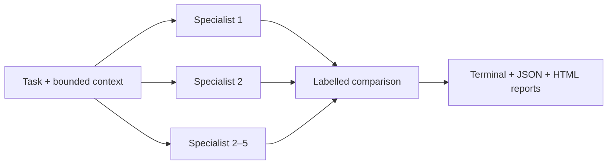
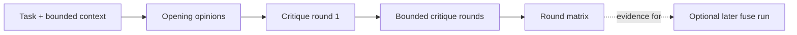
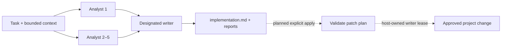
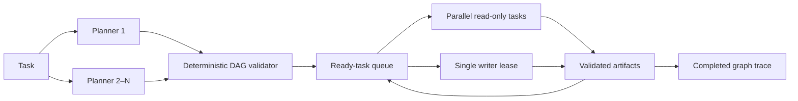
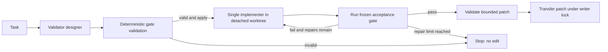
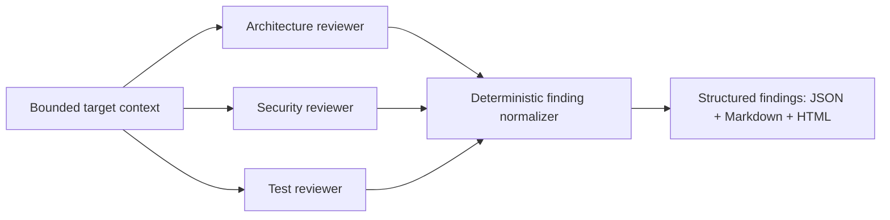

# `mind work` workflows

This document is the implementation plan for reusable agentic workflows in the
`mind` CLI. A workflow is an inspectable graph of bounded Alters, not a hidden
agent loop. Each one must preserve its graph trace, per-node model/executor/
attempt/token/timing data, and API-equivalent pricing snapshot under
`.alters/graphs/`.

## Shared rules

- Models are always explicit. A workflow must never make an unrequested
  provider call or silently select a fallback model outside configured retry
  policy.
- Context is host-read and bounded: regular project-contained files only, at
  most eight files, 32 KiB each, and 128 KiB in total.
- Research, review, planning, and validation Alters are tool-free by default.
  They cannot read the project except through supplied context, change files,
  use the shell, browse, or spawn descendants.
- A graph records every node state, attempt, token split, duration, executor,
  error, and truncated dependency edge. Cost is an API-equivalent estimate
  from the local OpenCode model catalog, never a subscription invoice.
- Workflow output must be useful without a dashboard, while HTML and JSON
  reports provide the detailed comparison and audit trail.
- Any workflow that changes a project must use an explicit, validated write
  boundary. Model text alone is never authorization to write files, execute
  commands, or commit code.

## Status at a glance

| Workflow | Status | Current boundary |
| --- | --- | --- |
| `opinion` | Implemented | Independent read-only reviewers only. |
| `debate` | Implemented | Read-only bounded critique rounds; no winner or writer. |
| `fuse` | Partially implemented | Research and writer synthesis are implemented; applying a change is intentionally not. |
| `collaborate` | Implemented | Validated DAG planning, concurrent readers, serialized isolated writers, and passing-patch transfer. |
| `validate` | Implemented | Frozen acceptance contract, isolated bounded repairs, deterministic gates, and passing-patch transfer. |
| `review` | Planned | Structured, read-only architecture/security/test findings. |

## `mind work opinion <task>`

**Purpose:** Run two to five read-only specialist Alters independently and
return a labeled comparison.



**Implemented interface:**

```bash
mind work opinion \
  --model provider-a/reviewer \
  --model provider-b/reviewer \
  [--context file]* [--max-tokens n] [--concurrency n] [--json] \
  "<task>"
```

**Current output:** terminal comparison; `result.json`; `opinion-report.json`;
and a self-contained `opinion.html` dashboard. `mind work opinion report
[graph-folder]` regenerates the reports without calling a model.

**Acceptance criteria:** reviewers are isolated and tool-free; models are
distinct and explicit; context containment is enforced; a failure is labeled
rather than presented as an opinion; retry-aware usage is shown per reviewer.

## `mind work debate <task>`

**Purpose:** Run bounded rounds of independent critique, injecting earlier
opinions as labeled evidence rather than instructions.



**Implemented interface:**

```bash
mind work debate \
  --model provider-a/reviewer \
  --model provider-b/reviewer \
  [--rounds 1-3] [--executor llm|opencode] \
  [--context file]* [--max-tokens n] [--concurrency n] [--json] \
  "<task>"
```

`--rounds` is the number of critique rounds after the opening panel. It defaults
to one and is capped at three.

**Execution:**

1. Run a two-to-five-model opening `opinion` panel.
2. For each configured critique round, run one critique node per model with the
   original task/context and compact, labeled prior claims.
3. Produce a terminal round view, `debate-report.json`, and a self-contained
   `debate.html` round matrix. `mind work debate report [graph-folder]`
   regenerates both reports without model calls. No winner or writer is added;
   the result is evidence for a human or a later `fuse` run.

**Required controls:** explicit `--model` values; `--rounds` bounded to a small
positive maximum; `--concurrency`; per-edge character bound; per-node token
limit; and `--json`. Critique prompts must state that prior text is untrusted
evidence and may be wrong.

**Acceptance criteria:** no node can see an unbounded prior transcript;
round N cannot start before its required evidence is persisted; failed critics
are visible; every round is attributable to a model and attempt; no Alter can
modify the project.

## `mind work fuse <task>`

**Purpose:** Read-only research Alters provide competing implementation
proposals; one designated writer synthesizes an implementation-oriented answer.



**Implemented interface:**

```bash
mind work fuse \
  --model provider-a/analyst \
  --model provider-b/analyst \
  --writer provider-c/writer \
  [--executor llm|opencode] [--writer-executor llm|opencode] \
  [--context file]* [--max-tokens n] [--concurrency n] [--json] \
  "<task>"
```

The writer starts only when every analyst succeeds. It receives the original
task/context plus bounded, labeled analyst outputs. The current implementation
creates `implementation.md`, `fuse-report.json`, and `fuse.html`; it does
**not** apply code changes.

When no executor override is supplied, tool-free workflow nodes automatically
prefer the direct `llm` executor for compatible API-key models and otherwise
use `opencode`. The workflow queues the full ready frontier at its natural
maximum concurrency. Multiple OpenCode nodes attach to one workflow-owned,
password-protected loopback server so one process owns the shared SQLite store;
if that server is unavailable, an executor-specific lane safely serializes
those nodes. Direct calls remain parallel. Explicit executor flags continue to
override automatic selection.

**CLI output:** The default human-readable output should follow the same
summary-first structure as `opinion`. It must begin with one compact Fuse run
summary containing:

- graph location and completion state;
- successful nodes versus total nodes and total wall time;
- aggregate input, output, reasoning, cache-read, and total tokens;
- aggregate API-equivalent estimated cost, clearly labeled as an estimate and
  not a subscription invoice;
- direct paths to the self-contained `fuse.html` dashboard and
  `fuse-report.json` pricing snapshot.

The writer's synthesized result should follow the run summary as the primary
answer. A compact section for the writer and each analyst should then show its
state, model, executor, attempts, elapsed time, token split, and estimated cost.
Failed or skipped nodes must be labeled explicitly instead of being presented
as successful output. The terminal should link to `implementation.md` when it
exists and leave full analyst material and detailed traces to the HTML and JSON
artifacts. `--json` continues to return the complete machine-readable workflow
result rather than this formatted view.

This makes a successful run useful at a glance without requiring the dashboard,
while keeping the terminal concise and making the detailed HTML report easy to
open.

**Planned application phase:** add an explicit `--apply` mode only after a
deterministic plan validator exists. The writer should emit a structured patch
plan limited to approved project paths. A single host-owned writer capability
must validate the plan, apply a patch atomically where possible, run an
explicit validation command, and retain a before/after audit record. One writer
at a time is required; analysts remain read-only.

**Acceptance criteria for application:** failed analyst or writer runs cannot
write; invalid or out-of-scope patches are rejected before mutation; only one
writer holds the project write lease; validation outcome is recorded; and no
commit, network action, or destructive operation occurs without separately
granted authority.

**Acceptance criteria for CLI reporting:** the summary is printed before node
details; aggregate token and cost figures include retry usage; every node's
usage remains attributable; unknown pricing is shown as unknown rather than
zero; artifact paths are present and valid; and failures still produce the
summary and report locations before the command exits nonzero.

## `mind work collaborate <task>`

**Purpose:** Planner Alters propose a task DAG; a deterministic validator
selects one valid plan; tasks execute when dependencies clear, with one writer
at a time.



**Implemented interface:**

```bash
mind work collaborate \
  --planner provider-a/planner \
  --planner provider-b/planner \
  --worker provider-c/worker \
  --write packages/core/src \
  --write packages/core/test \
  --command '["npm","run","check"]' \
  --command '["npm","test"]' \
  [--dry-run | --apply] \
  [--context file]* [--max-tasks 1-16] [--concurrency 1-16] \
  [--planner-max-tokens n] [--task-max-tokens n] [--max-total-tokens n] \
  [--command-timeout-ms n] [--deadline-ms n] [--json] \
  "<task>"
```

**Execution:**

1. Two to five tool-free planners emit a strict JSON task graph: task IDs,
   dependencies, role, approved worker model, allowed paths, expected outputs,
   and per-task token reservations. Validation commands remain exclusively
   operator-supplied.
2. A deterministic validator rejects cycles, unknown dependencies, duplicate
   IDs, invalid paths, missing acceptance checks, and plans whose estimated
   resources exceed the supplied ceiling.
3. The host selects a valid plan by transparent deterministic rules, persists
   it, and schedules ready tasks with a work-conserving queue.
4. Read-only tasks may run in parallel as soon as their dependencies clear.
   Writer tasks are transitively ordered and the OpenCode writer lane has
   concurrency one. In `--apply` mode all writers operate in one detached
   worktree; only a bounded patch that passes the frozen gate is transferred
   to an unchanged, clean source checkout under the host writer lock.

Each invocation creates a new immutable planner graph and, when applicable, a
separate persisted execution result. Runs are not resumed or overwritten; a
retry is a new auditable invocation. The token ceiling is a reservation limit:
planner reservations plus the selected plan's task reservations must fit
`--max-total-tokens`.

**Required controls:** explicit planner and worker models; `--max-tasks`;
whole-workflow token reservation, deadline, and concurrency ceilings; task
output schemas; allowed write paths; serialized writers; frozen operator gates;
and exactly one of `--dry-run` or `--apply`.

**Acceptance criteria:** malformed plans never execute; dependency-ready work
starts without an artificial batch barrier; independent readers may overlap;
writes never overlap; a failed dependency skips dependents; and the graph trace
explains every selection, skip, retry, and artifact handoff.

## `mind work validate <task>`

**Purpose:** Define a reproducible acceptance gate before an implementer changes
code, then use its results for a bounded repair loop.



**Implemented:**

```bash
mind work validate \
  --model provider/validator \
  --command '["npm","run","check"]' \
  --command '["npm","test"]' \
  [--dry-run | --apply --implementer provider/model --write path [--write path]*] \
  [--max-repairs 0..3] [--implementer-max-tokens n] \
  [--executor llm|opencode] \
  [--context file]* [--max-tokens n] \
  [--command-timeout-ms n] [--deadline-ms n] [--max-cost-usd n] [--json] \
  "<task>"
```

The operator supplies commands as JSON argument arrays, so they execute directly
without a shell. The tool-free designer may explain purposes, relevant supplied
files, and negative cases, but the deterministic validator rejects any changed,
added, reordered, or omitted command. It also checks the schema, existing
project-contained file references, zero-exit expectations, timeout ceilings,
whole-workflow deadline, and optional API-equivalent cost ceiling. By default the
frozen commands run sequentially and stop at the first failure; `--dry-run`
validates and records the contract without executing them.

With `--apply`, the source checkout must be a clean Git repository. The host
holds a project writer lock, creates a detached worktree at the exact source
revision, checks that the gate is runnable, and lets one coding implementer edit
only the explicit `--write` paths. The host—not the model—runs the frozen gate.
A failed gate is normalized and supplied to at most `--max-repairs` additional
attempts. A passing patch is rejected if it escapes the write boundary, deletes
a file, creates a symlink, exceeds the size ceiling, or if the source revision or
working tree changed during execution. After `git apply --check`, the validated
patch is transferred to the source checkout without staging or committing it.
An existing directory may be supplied as a write boundary when the task must
create files beneath it. The implementer has an independent 16,000-token default;
`--implementer-max-tokens` overrides it without changing the designer budget.

Every run writes bounded per-command gate artifacts,
`validation.json`, `validate-report.json`, and `validate.html`. `mind work
validate report [graph-folder]` regenerates the reports without model or command
execution. Apply runs also retain each implementer result, baseline and attempt
gate artifacts, changed files, and `validated.patch` after a successful transfer.
Source revision and before/after working-tree status are recorded.

**Required controls:** `--max-repairs`; hard whole-workflow deadline and cost
ceiling; command allowlist; isolated workspace or worktree; immutable test
artifacts; and explicit `--apply`/`--dry-run` behavior.

**Acceptance criteria:** no code edit precedes a valid gate; test failure is
never treated as success; repair attempts are counted and bounded; validation
cannot silently change its own criteria; and a passing result identifies the
exact commands, outputs, source revision, and changed files.

## `mind work review <target>`

**Purpose:** Produce structured architecture, security, and test findings
without modifying the target project.



**Proposed execution:**

1. The host expands `<target>` into a bounded, explicit read-only context set.
2. Dedicated reviewers assess architecture, authority/security, reliability,
   tests, and documentation against a shared finding schema.
3. A deterministic normalizer deduplicates exact duplicates, retains conflicting
   findings, and sorts by severity/evidence rather than model confidence alone.

**Finding schema:** ID, area, severity, title, evidence paths/lines, impact,
reproduction or reasoning, recommended remediation, and focused regression
test. A reviewer must mark uncertain claims as hypotheses.

**Acceptance criteria:** no project mutation or provider call outside explicitly
selected models; every finding links to supplied evidence; unsupported line
references are rejected; findings remain structured in JSON and readable in
Markdown/HTML; and no automatic fix is triggered.

## Delivery order

1. Finish the outstanding execution guarantees from the project review:
   constrained deletion, unified cancellation/deadlines, correct oscillation
   success semantics, retry-aware graph budgets, and fail-closed config.
2. Add the deterministic plan/patch/validation boundary needed for `fuse --apply`.
3. Build `validate`; reuse its acceptance-contract and repair primitives for
   `collaborate`.
4. `collaborate` is implemented on a work-conserving scheduler with immutable
   task records, bounded reservations, and a host-owned writer lease.
5. Build `review` as a read-only structured-report workflow, then connect it to
   `validate` only through an explicit human or host-approved handoff.

The detailed foundation work remains in
[`reviews/alter-spawner-2026-09-08/REVIEW.md`](../reviews/alter-spawner-2026-09-08/REVIEW.md).
